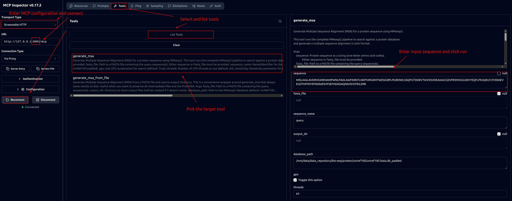

# MMseqs2 MCP service

## Install

## Create conda environment
```shell
mamba env create -p ./env python=3.10 pip fastmcp
mamba activate ./env
```

### Install the GPU version by downloading the compiled code
```shell
# Download and extract the GPU version
wget https://mmseqs.com/latest/mmseqs-linux-gpu.tar.gz
tar xvzf mmseqs-linux-gpu.tar.gz

# Copy the binary and libraries into your conda environment
cp mmseqs/bin/mmseqs $CONDA_PREFIX/bin/

# Clean up
rm -rf mmseqs mmseqs-linux-gpu.tar.gz
```

### Install the CPU version with conda (optional)
```shell
conda install -c conda-forge -c bioconda mmseqs2
```
## Create reference database
```shell
# Download Uniref100 database from Uniprot


# Create MMseqs2 DB from fasta file
mmseqs createdb uniref100.fasta uniref100.fasta.db

# Pad database for GPU search
mmseqs makepaddedseqdb uniref100.fasta.db uniref100.fasta.db_padded
```
## MCP uses cases

### Export the `MMSEQS2_DB_PATH` in the environment
```shell
export MMSEQS2_DB_PATH=/mnt/data/data_repository/bio-seq/protein/uniref100/uniref100.fasta.db_padded
```

### Debug with MCP inspector
```shell
# Start MCP server
fastmcp run src/mmseqs2_mcp.py:mcp --transport http --port 8001

# Run MCP inspector
npx @modelcontextprotocol/inspector
```

Config the server, pick the tool, enter the parameters and run the MCP service.


### Install MCP tool
```shell
fastmcp install claude-code too-mcps/mmseqs2_mcp/src/mmseqs2_mcp.py --python ./env/bin/python
fastmcp install gemini-cli too-mcps/mmseqs2_mcp/src/mmseqs2_mcp.py --python ./env/bin/python

# remove this mcp service from claude
claude mcp list
claude mcp remove mmseqs2
gemini mcp list
```
### Prompts to call MMseqs2 in claude code or gemini-cli:

```text
> Can you create the msa for DHFR sequence using mmseqs2 mcp, the sequence is: MISLIAALAVDRVIGMENAMPWNLPADLAWFKRNTLNKPVIMGRHTWESIGRPLPGRKNIILSSQPGTDDRVTWVKSVDEAIAACGDVPEIMVIGGGRVYEQFLPKAQKLYLTHIDAEVEGDTHFPDYEPDDWESVFSEFHDADAQNSHSYCFEILERR 
This is only for test purpose, so only 1 iteration is enough.
```
## Local use cases

### Esay search to get blastp like statistics (optional)
```shell
mmseqs easy-search examples/DHFR.fasta uniref100.fasta.db_padded examples/DHFR_aln.m8  examples/tmp --gpu 1 --threads 64
```
### Search and create a3m MSA file for downstream tasks
```shell
# Step 1: Create query database
mmseqs createdb examples/DHFR.fasta examples/DHFR_db 

# Step 2: Search (creates result DB instead of m8)
mmseqs search examples/DHFR_db uniref100.fasta.db_padded examples/DHFR_result_db examples/tmp --gpu 1 --threads 64
# Increase the number of hits with -s (sensitivity) parameter, --num-iterations, -e (e-value), --max-seqs parameters to achieve a matching performance with Jackhmmer
mmseqs search examples/DHFR_db uniref100.fasta.db_padded examples/DHFR_result_db examples/tmp --gpu 1 --threads 64 -s 7.5 --num-iterations 10 -e 0.001 --max-seqs 100000

# Step 3: Convert result to MSA
mmseqs result2msa examples/DHFR_db  uniref100.fasta.db_padded examples/DHFR_result_db examples/DHFR_msa_db --msa-format-mode 6

# Step 4: Extract to a3m file
mmseqs unpackdb examples/DHFR_msa_db examples/DHFR_msa --unpack-suffix .a3m

# Step 5: After unpackdb, concatenate if needed
cat examples/DHFR_msa/*.a3m >examples/DHFR.a3m
```


